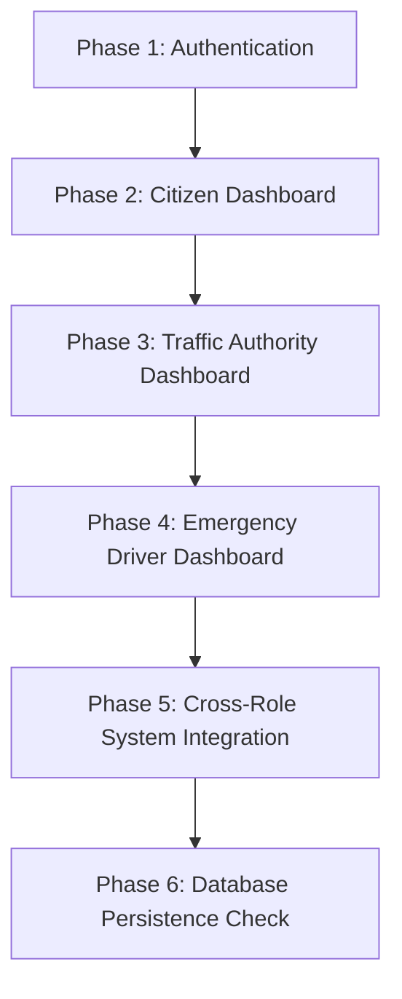

# Smart Traffic System - Testing & Validation Guide

This document provides a step-by-step walkthrough for verifying the functional modules of the FlowWave AI Traffic Optimization platform. Testing is split into role-specific interactions, API validations, and database integrity checks.

---

## 🏗️ System Testing Flow



---

### Phase 1: Authentication Testing

1. **Sign Up for Each Role**:
   * Navigate to the `/auth` page.
   * Create a **Citizen** account (normal user).
   * Create a **Traffic Authority** account.
   * Create an **Emergency Driver** account.
   * Verify that authentication confirmation alerts appear.

2. **Sign In & Route Verification**:
   * Test sign-in for each created account.
   * Verify that the app redirects to the specific role dashboard.
   * Verify sign-out clears the session and returns the user to the landing page.

---

### Phase 2: Citizen Dashboard Testing

1. **City-Wide Overview**:
   * Sign in as a **Citizen** user.
   * Verify the map renders and shows active intersections, hospitals, and ambulances.
   * Check intersection status cards (traffic density updates, green signals).
   * Verify the "Live Feeds" list displays active channels.

---

### Phase 3: Traffic Authority Dashboard Testing

1. **Intersection Management**:
   * Select an intersection from the dropdown list (e.g., Pune-based intersections).
   * Upload test videos for each lane (North, South, East, West).
   * Verify that the uploaded video loops continuously.
   * Verify that simulated AI detection overlays (bounding boxes) display on the video.

2. **Traffic Control**:
   * Verify that lane vehicle counts update automatically.
   * Test **GST (Green Signal Time)** calculations by triggering recalculations.
   * Manually override signal states (change from Green to Red) and verify it changes on the dashboard and database.

---

### Phase 4: Emergency Driver Dashboard Testing

1. **Emergency Corridor ("Green Wave") Request**:
   * Sign in as an **Emergency Driver**.
   * Locate an active ambulance or deploy one near Kothrud, Pune.
   * Select a destination hospital.
   * Trigger "Start Emergency Corridor".
   * Verify that the route highlights on the map and downstream traffic lights turn green.
   * Monitor ETA and remaining distance updates.
   * End the emergency corridor and verify signals return to dynamic scheduling mode.

---

### Phase 5: Cross-Role System Integration

1. **Multi-Role Live Simulation**:
   * Open two different browser sessions (one as Traffic Authority, one as Emergency Driver).
   * Trigger an emergency corridor from the driver portal.
   * Verify that the Traffic Authority dashboard shows the corridor request, locks the relevant signals to Green, and displays emergency logs.
   * Open a third session as a Citizen and verify the active corridor displays on the public map.

2. **Edge Function Validations**:
   * Monitor Network requests in Chrome/Firefox DevTools.
   * Check that calls to `/functions/v1/vehicle-detection` return bounding boxes and object counts.
   * Check that calls to `/functions/v1/gst-calculator` return signal timings according to vehicle count ratios.

---

### Phase 6: Data Persistence Testing

Verify that backend tables are correctly populated after testing flows:

| Database Table | Expected Entry/Update |
| :--- | :--- |
| `intersections` | Contains correct geolocation coordinates (Pune). |
| `lanes` | Updates dynamically with current vehicle count and active signals. |
| `video_feeds` | Records upload files and active status flags. |
| `logs` | Logs events (`ai_detection`, `gst_calculation`, `emergency_corridor`). |
| `emergencies` | Records active status, source, destination, and linked ambulance. |

---

## 🛠️ Debugging Steps

1. **Browser Console**: Inspect JavaScript compilation errors and React state changes.
2. **Network Logs**: Confirm that Supabase API requests return HTTP code `200` or `201`.
3. **Database Checks**: Use the Supabase Dashboard SQL Editor to query real-time states:
   ```sql
   SELECT * FROM public.lanes WHERE current_count > 0;
   ```
4. **Edge Function Logs**: Check Supabase console logs for runtime execution issues in edge functions.